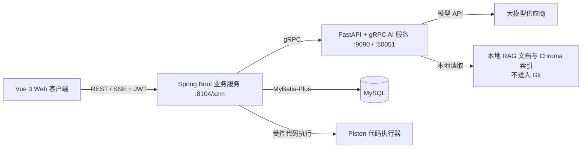

# XZM Interview Helper

一个面向技术求职场景的全栈 AI 面试辅助平台。项目把普通 AI 对话、基于简历的模拟面试、算法练习与 AI 复盘整合到同一套 Web 应用中，并通过 Java 服务统一处理认证、业务状态、持久化和限流，通过 Python 服务承载模型调用、流式生成与本地 RAG。

> 隐私说明：本仓库只包含可公开审查的源码和配置模板。真实 RAG 文档、Chroma 向量数据库、检索评测语料、个人图片、生产 E2E 脚本、部署环境信息、真实 `.env` 与密钥均未上传，也被仓库级 `.gitignore` 明确禁止提交。

## 核心能力

- AI 流式对话：支持 SSE 流式输出、思考阶段与正文阶段分离、Markdown/代码块增量渲染。
- 模拟面试 Agent：上传或粘贴简历，创建持久化面试会话，按主问题/追问策略推进，支持重试、结束和总结。
- 算法练习工作台：题目目录、Monaco 编辑器、样例运行、自定义输入、提交记录和 AI 代码复盘。
- 求职信息目录：按企业一行展示校招/实习岗位，支持行业、城市、批次、企业性质和来源筛选，每日自动聚合企业官网、公共就业平台、牛客、OfferShow、Offer 稳了与微信公众号公开文章。
- RAG 检索增强：本地文档分块、稠密检索与词法检索融合、重排、父文档去重及检索阈值控制。
- 用户与权限：JWT 登录、管理员接口、请求限流、可信代理解析与跨域白名单。
- 管理员服务器 Agent：在管理员专属工作区中执行有界 ReAct 任务、受控命令、文件与站点操作，并对危险动作进行一次性精确审批和审计。
- 可观测流式协议：Java 将 Python gRPC 事件转换为浏览器可消费的 SSE 帧，并保存会话与事件状态。

## 系统架构



职责边界：

- `frontend` 负责交互、路由、状态管理、流式 Markdown 渲染和算法编辑器。
- `backend-java` 是对浏览器的业务网关，负责认证授权、数据库事务、会话状态、限流、SSE 和代码执行编排。
- `backend-ai` 负责模型适配、面试 Agent 决策、RAG 管线及 gRPC/HTTP AI 接口。
- RAG 文档和索引只存在于开发者或部署环境本地，不属于源码仓库。

## 目录结构

```text
.
├── frontend/       # Vue 3 + Vite 客户端
├── backend-java/   # Spring Boot 3 / Java 17 业务后端
├── backend-ai/     # FastAPI + Python AI 后端
├── .gitignore      # 仓库级隐私与构建产物保护规则
├── SECURITY.md     # 密钥、RAG 数据与发布安全约定
└── README.md
```

## 技术栈

| 层 | 主要技术 |
| --- | --- |
| Web | Vue 3、Vite 7、Pinia、Vue Router、Element Plus、Tailwind CSS、Axios、Monaco Editor、Vitest |
| Java 后端 | Spring Boot 3.5.4、Java 17、Spring Security、JWT、MyBatis-Plus、WebFlux/SSE、gRPC、MySQL |
| AI 后端 | FastAPI、Uvicorn、grpcio、Pydantic Settings、ChromaDB、pytest |
| 外部能力 | 大模型 API、Embedding API、Piston 代码执行器（可选） |

## 主要业务链路

### 1. AI 对话

1. 浏览器向 Java `/xzm/longcat/*` 接口发起携带 JWT 的请求。
2. Java 执行用户校验、并发准入和会话历史处理。
3. Java 通过 gRPC 调用 Python AI 服务。
4. Python 选择模型和提示词模式，可选执行本地 RAG 检索。
5. 流式阶段事件被转换为 SSE，前端按阶段渲染并最终固化消息。

### 2. 模拟面试

1. 用户创建面试会话，可提交目标岗位和简历文本/文件。
2. Java 持久化 session、turn、event，并校验面试状态机。
3. Python Agent 根据当前问题、回答、题数约束和检索上下文返回下一动作。
4. Java 只向前端暴露候选人可见字段，不传递模型原始思维链。
5. 面试结束后生成结构化总结，前端展示报告。

### 3. 算法练习

1. 前端加载题目列表与题目详情，在 Monaco 中维护本地工作区。
2. Java 对运行和提交请求进行认证、限流及参数约束。
3. 代码通过配置的 Piston 服务执行，执行结果与提交记录分离保存。
4. 用户可触发 AI Review；处理中状态通过只读接口轮询，完成后展示建议。

## 本地环境要求

- JDK 17+
- Maven 3.8+
- Node.js 20+
- Python 3.10+
- MySQL 8+
- 可选：Docker / Piston、本地 Chroma 持久化目录

## 配置

所有真实配置都应写入本地 `.env` 或部署平台的 Secret Manager。不要修改并提交示例文件中的占位符。

### Java 业务服务

```powershell
Copy-Item backend-java/.env.example backend-java/.env
```

至少配置：

- `JWT_SECRET`：不少于 32 字符的随机值。
- `DB_URL`、`DB_USERNAME`、`DB_PASSWORD`：MySQL 连接信息。
- `APP_CORS_ALLOWED_ORIGINS`：允许访问 API 的前端来源。
- `LONGCAT_API_KEY`：如使用对应的直连聊天能力。
- `PISTON_API_URL`、`PISTON_API_TOKEN`：如启用算法代码执行。

注册验证默认使用服务端生成的计算图片验证码。需要启用邮箱验证码时，设置
`AUTH_EMAIL_VERIFICATION_ENABLED=true`，并配置 `AUTH_MAIL_FROM`、`MAIL_HOST`、
`MAIL_PORT`、`MAIL_USERNAME`、`MAIL_PASSWORD`。QQ 邮箱的 `MAIL_PASSWORD` 必须使用
SMTP 授权码，不能填写邮箱登录密码；凭据只应存在于部署环境变量中。

### Python AI 服务

```powershell
Copy-Item backend-ai/.env.example backend-ai/.env
```

按实际供应商配置 `BIGMODEL_API_KEY`、`DEEPSEEK_API_KEY` 和/或 `SILICONFLOW_API_KEY`。模型白名单与请求级模型覆盖开关也在该文件中。

RAG 数据必须本地准备：

```powershell
New-Item -ItemType Directory backend-ai/docs -Force
New-Item -ItemType Directory backend-ai/chroma_db -Force
```

将私有 Markdown/TXT 文档放入 `backend-ai/docs`。服务启动时会构建或更新 `backend-ai/chroma_db`，这两个目录都被 Git 忽略。

### Web 客户端

```powershell
Copy-Item frontend/.env.example frontend/.env
```

本地开发建议保留 `VITE_API_BASE=/xzm`，由 Vite 代理到 Java 服务，避免在浏览器代码中硬编码服务器地址。

## 启动顺序

### 1. Python AI 服务

```powershell
cd backend-ai
python -m venv .venv
.\.venv\Scripts\Activate.ps1
pip install -r requirements.txt
python main.py
```

默认监听：

- HTTP：`127.0.0.1:9090`
- gRPC：`127.0.0.1:50051`

### 2. Java 业务服务

```powershell
cd backend-java
mvn spring-boot:run
```

默认 API 根路径：`http://127.0.0.1:8104/xzm`。

首次运行前应创建数据库，并按 `backend-java/src/main/resources/sql/` 下的脚本核对表结构。面试 Agent 表可由配置的初始化脚本创建；生产环境仍建议使用正式迁移工具管理版本。

### 3. Vue 客户端

```powershell
cd frontend
npm install
npm run dev
```

浏览器访问 `http://127.0.0.1:5173`。

## 页面入口

| 路由 | 功能 |
| --- | --- |
| `/chat` | AI 对话 |
| `/aiInterview` | 模拟面试 |
| `/interview-report` | 面试报告 |
| `/algorithms` | 算法练习工作台 |
| `/recruitment` | 每日更新的校招与实习信息目录 |
| `/applications` | 每个登录用户独立的投递追踪看板 |
| `/knowledge` | 个人资料、公共知识库与职位上下文管理 |
| `/login`、`/register` | 登录与注册 |
| `/admin/users` | 管理员用户管理 |
| `/admin/server` | 管理员服务器 Agent、直接工具与审计日志 |

## Java API 概览

| 前缀 | 说明 |
| --- | --- |
| `/xzm/user` | 登录、注册与用户信息 |
| `/xzm/longcat` | 普通/思考模式流式聊天 |
| `/xzm/interview-agent` | 面试会话、答题、重试、查询与 SSE |
| `/xzm/algorithm` | 题目、运行、提交、面试模式与 AI Review |
| `/xzm/api/recruitments` | 公开只读的招聘目录、筛选项与更新状态 |
| `/xzm/record` | 会话历史与记录管理 |
| `/xzm/admin` | 管理员操作 |

### 管理员服务器 Agent

服务器 Agent 默认关闭，只有数据库中当前仍为管理员的账号才能访问 `/admin/server-agent/**`。浏览器不会收到系统密码、SSH 私钥或模型密钥；Java 服务负责命令分类、文件根目录约束、并发与超时限制、输出脱敏和审计。写文件、建站、未知命令及服务变更等动作会先返回绑定完整动作摘要的短期审批请求，确认令牌只能使用一次，修改动作后自动失效。这里的审批是管理员登录会话内的操作确认，用于阻止 Agent 自主执行变更，并不是独立的 MFA；需要抵御管理员令牌失窃时，应另行接入密码重验、WebAuthn 或短时 elevated claim。

生产启用前至少配置：

- `SERVER_AGENT_ENABLED=true`：显式开启；缺省为 `false`。
- `SERVER_AGENT_WORKING_DIRECTORY`：命令工作目录，建议使用专属、可写目录。
- `SERVER_AGENT_SITE_ROOT`：Agent 生成站点的专属目录，不要与前端发布目录混用。
- `SERVER_AGENT_SITE_PUBLIC_BASE_URL`：生成站点的公开路径，默认 `/agent-sites`。
- `SERVER_AGENT_ALLOWED_ROOTS`：结构化文件工具允许访问的绝对路径列表。
- `SERVER_AGENT_COMMAND_TIMEOUT_SECONDS`、`SERVER_AGENT_MAX_OUTPUT_CHARS`、`SERVER_AGENT_MAX_STEPS`：执行边界。
- `SERVER_AGENT_AI_PROVIDER`、`SERVER_AGENT_AI_MODEL`：ReAct 决策使用的现有 Python gRPC 模型。

生成站点应由 Nginx 的独立 `location` 暴露，并添加 CSP `sandbox`，避免生成页面读取主应用同源登录状态。Java 服务应继续使用低权限系统账号；不要为了服务重启能力把整个业务服务改为 root。状态接口会按实际账号权限保守返回 `capabilities`，前端据此禁用不可用工具。

生产环境应让生成站点使用独立端口或独立域名，并保持 CSP `sandbox`；同步 `/xzm/admin/server-agent/run` 的 Nginx `proxy_read_timeout` 应至少为 1300 秒，以覆盖 8 步 AI 决策与工具执行的最坏边界。低权限服务账号不具备 systemd 变更权限时，页面只开放服务状态查询，不开放启动、停止或重启。

### 招聘信息自动更新

Java 服务启动后会在 20 秒后进行首次新鲜度检查，此后每小时检查一次；距离上次成功同步超过 20 小时才执行抓取，失败则在下一小时自动重试。数据写入 MySQL，服务重启不会丢失。默认抓取当前年份下一届毕业生信息，并在 60 天未再次发现后隐藏过期记录。

可通过环境变量调整：

- `RECRUITMENT_GRADUATE_YEAR`：目标毕业年份，留空或 `0` 时自动取下一年。
- `RECRUITMENT_PLAYOFFER_PAGES`：Offer 稳了每日扫描的最新页数，默认 `20`。
- `RECRUITMENT_OFFERSHOW_PAGES`：OfferShow 每日扫描的最新页数，默认 `20`；公开的微信公告保留原文链接。
- `RECRUITMENT_MINIMUM_REFRESH_HOURS`：两次成功同步之间的最短小时数，默认 `20`。
- `RECRUITMENT_CHECK_INTERVAL_MS`：失败重试/新鲜度检查间隔，默认每小时。
- `RECRUITMENT_STALE_AFTER_DAYS`：连续未发现后隐藏记录的天数，默认 `60`。

投递前仍应以企业官网或原始招聘公告为准。微信公众号只读取搜索引擎已公开索引的文章，不需要也不保存用户微信登录信息。

## 测试与构建

```powershell
# Java：单元测试与集成测试（部分依赖外部数据库的测试会按条件跳过）
cd backend-java
mvn test

# Python
cd ..\backend-ai
pytest

# Frontend
cd ..\frontend
npm test
npm run build
```

当前验证结果：Java 143 项通过/7 项条件跳过，Python 79 项通过/3 项跳过，前端 157 项通过。

## 安全设计要点

- JWT、数据库密码和供应商 API Key 只从环境变量读取。
- 用户密码使用 BCrypt 存储；历史明文记录在首次成功登录后自动迁移，不中断现有账户。
- Python HTTP/gRPC 默认绑定回环地址；如需对外暴露，应通过受保护的反向代理或内部网络。
- CORS 使用显式白名单，生产环境不要保留宽泛来源。
- 简历上传有大小限制，业务层对用户、会话和资源归属进行校验。
- 登录、AI 请求、算法执行与 AI Review 均有准入/限流机制。
- Piston 默认指向本机地址，避免因漏配而把候选人代码发送到公共执行器。
- 面试 Agent 响应不包含原始模型思维链。
- 服务器 Agent 的危险操作需要显示完整脱敏摘要并进行精确动作审批；审批令牌短期、单次且绑定管理员和动作哈希。
- 服务器 Agent 子进程会移除敏感环境变量，文件工具拒绝凭据目录/扩展名；生成站点必须使用 CSP sandbox 与主应用登录态隔离。

更多发布前检查见 [SECURITY.md](SECURITY.md)。

## RAG 与隐私数据约定

以下内容永远不应进入 Git：

- 原始知识库文档、简历、面试记录或用户上传文件；
- `chroma.sqlite3`、HNSW/Chroma 二进制索引、pickle、词法缓存；
- 从私有知识库派生的评测问题、标准答案和评测结果；
- 真实 `.env`、本地模型配置、密钥、证书、生产 IP 和运维日志。

如果误提交过敏感信息，仅从最新提交删除是不够的：应立即轮换凭据，并使用 `git filter-repo` 或 BFG 清理完整历史后再发布。

## 说明

本仓库是一个经过隐私清理的单仓库版本，因此不保留原项目中嵌套 Git 仓库、历史向量数据或环境专用部署脚本。运行 RAG 功能需要维护者在本地补充自己的文档和索引。
