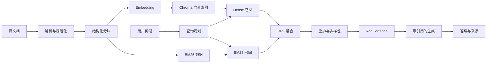

# XZM Interview Helper：RAG 完整流程与实现说明

## 1. 目标与范围

本文说明本项目从文档进入知识库，到在线检索、重排、引用生成、降级和评测的完整链路。实现位于：

- `services/rag_pipeline.py`：规范化、结构化分块、BM25、RRF、重排、证据对象。
- `services/rag_service.py`：SiliconFlow Embedding、Chroma 持久化、增量索引和混合检索。
- `services/zhipu_service.py`：查询规划、证据注入、引用约束和 SSE 阶段事件。

RAG 的职责不是“把搜索结果塞给模型”，而是构造一条可评测、可降级、可追溯的数据链：



## 2. 传统 RAG 的常见缺陷与本项目修复

| 缺陷 | 后果 | 当前方案 |
|---|---|---|
| 只做向量检索 | 类名、错误码、版本号等精确词召回差 | Dense 与 BM25 双路召回 |
| 按固定字符粗暴切块 | 标题、代码和语义边界被破坏 | 标题感知、代码块完整、父子关系和重叠窗口 |
| 同内容文件共用 chunk id | 不同路径互相覆盖 | id 绑定 `source_path + file_hash + logical_chunk_id` |
| 更新时先删旧向量 | Embedding 失败后知识永久丢失 | 先写新版本，成功后清旧版本，失败回滚部分写入 |
| 删除源文件不清索引 | 检索出已经不存在的内容 | 每次索引按当前源清单清理 stale chunks |
| 向量库故障后 RAG 完全不可用 | 外部接口或 Chroma 故障直接中断回答 | 本地源文档优先构造 BM25，Dense 可独立降级 |
| 只返回裸文本 | 用户无法判断出处，生成端无法稳定引用 | `RagEvidence` 提供 `[S1]`、文件、章节、通道和分数 |
| 将文档直接拼入系统提示词 | 文档内恶意指令可能污染模型 | JSON 数据边界、HTML 符号转义、明确“不可信资料” |
| 无并发控制 | 启动和人工重建可能重叠写索引 | 进程内非阻塞索引锁 |
| Embedding 响应缺少校验 | 顺序错乱、缺向量、维度异常进入索引 | 校验数量、index 顺序和统一非零维度 |
| 重排只看相似度 | 多个相邻重复块占满 top-k | query coverage、标题命中、RRF、近重复和父块配额 |

仍需认识到：当前重排是确定性轻量重排，不等价于 Cross-Encoder；当前引用是“受提示词约束的引用”，还没有服务端逐句做自然语言蕴含验证。

## 3. 离线索引：文档准备

### 3.1 文档准入

当前支持 `.md`、`.txt` 和可提取文本的 `.pdf`。入库前建议完成：

1. 确认来源、授权范围、保密级别和有效期。
2. 删除密码、Token、身份证号等不应进入模型上下文的数据。
3. 保留清晰标题层级、代码围栏、表格字段和版本信息。
4. 为文档建立稳定相对路径；路径是来源身份的一部分。
5. 扫描页 PDF 应先 OCR；当前 `pypdf` 只能读取文本层。

文档元数据至少应包含：`source_path`、`file_name`、`document_title`、`section_path`、`content_type`、`file_hash` 和父子 chunk 关系。后续权限过滤、引用、删除和审计都依赖元数据，不能只保存正文。

### 3.2 解析与规范化

解析阶段统一换行、去除展示型 HTML、清理异常空白，但保留代码、技术标识符和标题语义。规范化要“最小损失”：过度清洗会删除 `C++`、`spring.profiles.active`、异常栈和配置键，导致 BM25 精确召回失效。

PDF 的关键风险包括错序、多栏混排、页眉页脚重复和表格结构丢失。生产环境应抽样比对“原文—解析文本—最终 chunk”，并记录解析器版本。

## 4. 离线索引：结构化分块

### 4.1 为什么要分块

整篇文档直接嵌入会把多个主题压缩到一个向量中，召回结果过长且不聚焦；分块太小又会丢上下文。分块是召回率、精度、延迟和生成上下文成本之间的平衡。

当前流程：

1. 根据 Markdown 标题建立章节路径。
2. 保证 fenced code block 尽可能完整。
3. 按目标 token 数形成 chunk，达到上限时切分。
4. 引入有限 overlap，降低答案跨边界时的漏召回。
5. 保存 `previous_chunk_id`、`next_chunk_id` 和 `parent_id`。
6. 为检索文本增加轻量标题上下文，但保留原始正文作为证据。

默认逻辑参数应通过离线评测调优，而不是凭感觉固定：目标块约 300–500 tokens，最大块约 500–700 tokens，重叠约 10%–20% 是常见起点。代码、FAQ、表格和长叙述可以采用不同策略。

### 4.2 Chunk ID 与版本

逻辑 chunk id 用于表达内容结构；实际向量 id 计算为：

```text
SHA256(casefold(source_path) + ":" + file_hash + ":" + logical_chunk_id)
```

这样可保证：同内容不同路径不覆盖；同路径新旧文件版本不覆盖；重试同一版本得到相同 id，具备幂等性。

## 5. 离线索引：Embedding

项目调用 SiliconFlow 的 OpenAI 兼容端点 `POST /v1/embeddings`。请求包含：

```json
{
  "model": "BAAI/bge-large-zh-v1.5",
  "input": ["chunk 1", "chunk 2"],
  "encoding_format": "float"
}
```

实现上的关键点：

- 空字符串在客户端拒绝，避免无意义计费和服务端 400。
- 按条数和总字符数双重控制批次。
- `bge-large-zh-v1.5` 上限 512 tokens，默认估算上限 480，并对 512-token 模型增加 416 个 Unicode 字符的硬上限，给供应商 tokenizer、特殊 token 和混合标点留余量。
- 只在模型明确支持时设置 `dimensions`；变更模型或维度必须新建 collection 或完整重建。
- 超时默认 20 秒，SDK 重试默认 2 次；429、503、504 仍应由上层监控。
- 响应按 `index` 恢复输入顺序，并校验“向量数等于输入数”“维度统一且非零”。
- 日志可记录 `x-siliconcloud-trace-id`，但不得记录 API Key 或完整敏感正文。

Embedding 向量只表达模型学到的语义位置，不是可逆加密。敏感原文及其向量都应按敏感数据管理。

## 6. 离线索引：向量存储与一致性

Chroma 保存 id、原始 chunk、向量和元数据。增量索引过程如下：

1. 扫描当前文档目录，生成 `source_path -> file_hash` 清单。
2. 读取已持久化记录并按 `source_path` 分组。
3. 删除源目录中已不存在文件的 stale ids。
4. 未变化且分块完整的文件直接跳过。
5. 对新增或变化文件生成“带版本的新 ids”。
6. 批量 upsert 新版本；批次失败时递归缩小批次定位单条错误。
7. 文件级写入失败时删除本轮部分新 ids，保留旧版本。
8. 新版本全部成功后再删除该源旧 ids。
9. 使 BM25 缓存失效并基于当前源清单重建。

这一机制提供文件级的近似两阶段切换，但 Chroma 并非关系数据库事务。多进程或多实例同时写同一目录时，仍需分布式锁或“构建新 collection 后切别名”的蓝绿索引方案。

## 7. 在线检索：查询规划

请求进入 Python 服务后先进行关键词规划。模型只允许返回 3–6 个 JSON 关键词；超时、格式错误或服务故障时使用确定性正则回退。最终检索查询始终保留用户原问题，再追加关键词，防止关键词模型幻觉抹掉原始意图。

安全前置规则会对“索要生产密码、Token”等明显秘密请求停止检索，避免知识库内容被当成秘密发现接口。生产系统还应按用户、租户和文档 ACL 在召回前做元数据过滤。

有限查询扩展用于补充经过审核的同义词，例如“主动关闭连接”扩展到 `TIME_WAIT`、`2MSL`。扩展表必须可审查；无限生成式扩展可能造成查询漂移。

## 8. 在线检索：双路召回

### 8.1 Dense 语义召回

Dense 检索把查询编码成向量，在 Chroma 中按距离寻找语义相近 chunk。优点是能匹配不同表述；缺点是精确标识符、数字和新术语可能表现不稳定，并依赖远程 Embedding。

Dense 候选量应大于最终 top-k，例如先召回 20–50 条，再交给融合和重排。向量距离只在同模型、同维度、同距离度量下可比较，不能跨 collection 生搬阈值。

### 8.2 BM25 词法召回

BM25 根据词频、逆文档频率和长度归一化打分，适合类名、方法名、版本号、错误码和原句。当前 BM25 优先从源文档构建，避免 Chroma 中的旧文本污染降级结果；只有源文档未挂载时才回退读取 Chroma。

中文分词质量会显著影响 BM25。当前轻量 tokenizer 适合小型技术库；规模扩大后应引入领域词典、中文分词器和字段权重。

## 9. 融合、重排和选择

### 9.1 RRF 融合

Dense 与 BM25 的原始分数不在同一尺度，不能直接相加。Reciprocal Rank Fusion 只使用名次：

```text
RRF(d) = Σ 1 / (k + rank_i(d))
```

同一 chunk 同时被两路召回会获得更高融合分。RRF 稳定、无需训练，是混合检索的可靠基线。

### 9.2 轻量重排

当前重排综合：RRF 分、查询词覆盖率、标题/章节命中、精确技术标识符和内容质量。随后执行：

- 最低重排分阈值。
- 最低查询覆盖率阈值。
- 内容指纹近重复删除。
- 每个 parent 的最大 chunk 数限制。
- top-k 截断。

这一步解决“召回相关但回答价值低”和“相邻重复块挤占窗口”。知识库扩大后，可在融合后的几十条候选上增加 Cross-Encoder Reranker；它更准确，但增加模型调用延迟、成本和可用性依赖。

## 10. 证据与引用

最终候选转换为 `RagEvidence`：

```json
{
  "id": "S1",
  "source_path": "java/concurrency.md",
  "document_title": "Java 并发",
  "section_path": "CAS > ABA",
  "content_type": "text",
  "content": "..."
}
```

提示词要求模型使用资料事实时在句末写 `[S1]`，并禁止编造编号。SSE 的 `publicSources` 只返回有界元数据：编号、标题、路径、章节、召回通道和重排分，不回传完整知识正文。

检索文档被 JSON 编码并转义 `<`、`>`、`&`，放入 `<untrusted_rag_context>` 数据边界；系统提示明确禁止执行文档内指令。这是 Prompt Injection 的纵深防御，不代表完全消除风险。高风险场景还应加入来源白名单、内容扫描、工具权限隔离和输出策略检查。

严格引用验证的演进方向：从生成答案中解析 `[Sx]`，拒绝未知编号；将句子与证据做蕴含校验；对无证据事实标为模型常识；最终同时评测 citation precision、citation recall 和 faithfulness。

## 11. 降级与故障处理

| 故障 | 行为 |
|---|---|
| SiliconFlow 未配置 | 跳过 Dense，使用本地 BM25 |
| Embedding 超时/限流 | 开启短路冷却，当前请求继续 BM25 |
| Chroma 不可读 | 从源文档重建 BM25 |
| 源文档未挂载 | 最后回退到 Chroma 中的文本构造 BM25 |
| 关键词模型失败 | 使用确定性关键词提取 |
| 无候选通过阈值 | 明确“未命中资料”，使用模型知识回答 |
| 索引更新失败 | 回滚部分新 ids，保留旧向量版本 |

降级必须可见：SSE retrieval 阶段使用 `degraded` 状态，日志记录故障类别。不要把“生成模型仍能回答”误报成“知识库命中”。

## 12. 配置

```dotenv
SILICONFLOW_API_KEY=
SILICONFLOW_BASE_URL=https://api.siliconflow.cn/v1
EMBEDDING_MODEL=BAAI/bge-large-zh-v1.5
EMBED_MAX_TOKENS=480
# EMBEDDING_DIMENSIONS=1024
EMBED_TIMEOUT_SECONDS=20
EMBED_MAX_RETRIES=2
DOCS_DIR=docs
CHROMA_PERSIST_DIR=chroma_db
```

API Key 只能存在于环境变量或服务器密钥系统，不得写入源码、示例、日志、SSE 或 Git 历史。任何在聊天、工单或截图中公开过的 Key 都应视为泄露并立即吊销。

## 13. 评测体系

离线评测集至少包含：问题、相关文档/chunk、期望关键事实、不可回答标记和权限标签，并覆盖同义改写、精确术语、跨章节、时效冲突、对抗指令和秘密请求。

检索指标：

- Recall@K：相关证据是否进入候选。
- Precision@K：返回结果中相关证据比例。
- MRR / nDCG：正确证据是否排得足够靠前。
- 去重率与来源多样性。
- Dense、BM25、融合、重排各阶段的增益。

生成指标：

- Faithfulness：回答是否被证据支持。
- Answer correctness / completeness。
- Citation precision / recall。
- 拒答正确率与越权泄露率。
- 端到端 P50/P95 延迟、Token 与 Embedding 成本。

调参时一次只改变一个主要变量，并使用固定评测集回归。不能用“看起来不错的几个问题”代替指标。

## 14. 可观测性与运维

建议记录不含敏感正文的结构化字段：请求 id、查询哈希、Dense/BM25 候选数、融合数、最终证据 ids、降级原因、各阶段耗时、模型/维度/collection 版本，以及 SiliconFlow trace id。

上线门禁：

1. Python 单元测试全绿。
2. 前端流协议测试全绿且生产构建成功。
3. 密钥扫描无命中。
4. 新索引能够完整构建，源文档删除测试通过。
5. 备份现有 Python 源码、前端产物和向量库策略已确认。
6. 灰度验证检索命中、引用编号、降级状态和流式结束帧。
7. 保留上一镜像和前端目录，健康检查失败自动回滚。

当 Embedding 模型或维度发生变化时，不应在旧 collection 原地混写。正确流程是建立新版本 collection、全量构建、离线评测、灰度切换、观察后删除旧版本。

## 15. 一次请求的完整示例

1. 用户问：“CAS 为什么有 ABA，怎么解决？”
2. 查询规划保留原问题并提取 `CAS`、`ABA`、`AtomicStampedReference`。
3. Dense 找到语义相关的并发章节；BM25 精确命中类名和 ABA。
4. RRF 提升双路共同命中的 chunk。
5. 重排根据覆盖率和标题命中排序，删除相邻重复块。
6. 候选转换为 `[S1]`、`[S2]` 证据记录。
7. 生成模型在不可信 JSON 上下文中回答，并在证据事实后写 `[S1]`。
8. 前端展示答案，同时把 `[S1]` 映射到文档标题、路径和章节。
9. 若 Dense 调用失败，阶段标为降级，BM25 仍完成检索；若两路均无可靠证据，则说明未命中并使用模型知识回答。

## 16. 后续演进优先级

1. 建立真实问答标注集和自动回归看板。
2. 增加 ACL/租户过滤，确保权限在召回前生效。
3. 引入可选 Cross-Encoder Reranker 并设超时降级。
4. 增加服务端引用合法性和蕴含验证。
5. 使用版本化 collection 蓝绿切换支持多实例安全更新。
6. 为扫描 PDF、表格和图片加入 OCR/多模态解析。
7. 根据热度、有效期和来源权威性加入 freshness/authority 特征。

这套流程的核心不是让模型“知道更多”，而是让每一次知识使用都可定位、可解释、可评测，并在外部服务异常时仍能以明确状态继续工作。
